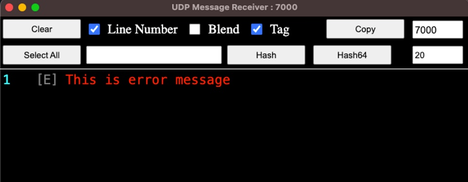

# UDP Message Receiver

## Protocol

Send messages in text format using UDP.

- Just send the normal text and it will be listed in the message window.
- If send in Json text format, it will be displayed in tag and msg format.
- For example, you can send tag and msg like this:
  ```json
  {"tag": "E", "msg": "This is error message"}
  ```
- Then the tag will be displayed like [E] in front as follows. And, the msg part is displayed in red. <br><br>

<br><br>

### Clear
Since version 1.0.2 the clear protocol has been added.
- Just send .clear to clear the output list. _(Note the dot mark before clear.)_
- Sending a JSON-formatted string {"cmd": ".clear"} works the same as .clear
<br><br>


## Tags

- I (Capital Letter I)<br>
Information, White

- D<br>
Debug, Green

- W<br>
Warning, Yellow

- E<br>
Error, Red

- _{Other char}_ ex: A
Gray
<br><br>

## Functions
- [Copy] Button<br>
This function copies the selected text to the clipboard.
- [Portnumber] Input, _Default is 7000_<br>
If you move your mouse to the top right corner of displayed as 7000 in the above captured picture, a vertical spin is displayed on the right. The arrows are small and can be difficult to see. You can edit the port number with it, or you can enter the port number directly in the corresponding input box with the keyboard. Changing it will automatically restart the UDP server.
- [✔] Line Number<br>
Displays the line number at the far left of the output window.
- [✔] Blend<br>
Make the screen semi-transparent and set it to Topmost. Transparency is a value of 0.7. If there is a need to improve the transparency so that it can be adjusted in the future, it will be improved. <span style="color: red;">However, this function does not work on Linux.</span>
- [✔] Tag<br>
You can display or not display the tag of the displayed content. Default settings will be marked as checked.
<br><br>

## Preserve custom state
As the user modifies each option (e.g. port number or checkbox), it is immediately saved to the app's settings area. Therefore, when restarting in the future, the last used values are applied.
<br><br>

## Source or Install images
This code was developed using Node.js and can be run with Electron. If the execution environment is not suitable, you can install and use it using the installation image from the link shown below.
<br><br>

## For Windows
x86 (32-bit or 64-bit available)<br>
https://cdn.certchip.com/udpr/UDP_Message_Receiver_Setup_1.0.2-x86.exe<br>
x64 (Only for 64-bit)<br>
https://cdn.certchip.com/udpr/UDP_Message_Receiver_Setup_1.0.2-x64.exe<br>
<br><br>

## For macOS
Intel<br>
https://cdn.certchip.com/udpr/UDP_Message_Receiver-1.0.2-Intel.dmg<br>
Silicon<br>
https://cdn.certchip.com/udpr/UDP_Message_Receiver-1.0.2-Silicon.dmg<br>
<br><br>

## For Linux (Only 64bits)
Redhat (RPM)<br>
https://cdn.certchip.com/udpr/udpr-1.0.2.x86_64.rpm<br>
Debian (DEB)<br>
https://cdn.certchip.com/udpr/udpr_1.0.2_amd64.deb<br>
<br><br>


  ```text
  Comments written in the source codes are written in English and Korean.
  ```